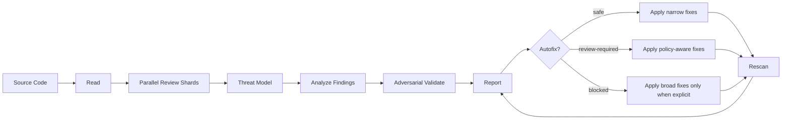

# presecurity

[한국어](한글.md)

presecurity is a local, source-based **code security review** plugin for
Claude and Codex. It helps experts and non-experts inspect a codebase, find
realistic vulnerabilities, produce reviewable evidence, and apply controlled
root-cause fixes.

It inherits the concept of Codex Security artifacts as a lightweight local
workflow, but it does not depend on a cloud service. The host coding agent reads
the local source tree and writes local artifacts only.

## Installation

Repository:

```text
https://github.com/ilous12/presecurity
```

Claude Code:

```text
/plugin marketplace add https://github.com/ilous12/presecurity
/plugin install presecurity@presecurity-marketplace
```

Claude Desktop:

1. Open Claude Desktop.
2. Open the Customize menu in the left sidebar.
3. Open the Plugins tab.
4. In Personal plugins, click `+` and choose Add marketplace.
5. Choose Add from a repository.
6. Enter `https://github.com/ilous12/presecurity`.
7. Install `presecurity`.
8. Start a new chat or Cowork task.
9. Run `/presecurity scan`.

Claude Desktop can also install a custom plugin file if you package and share
one separately. For repository-based installation, use the marketplace flow
above so updates can be synced from GitHub.

Codex CLI:

```text
codex plugin marketplace add ilous12/presecurity --ref main --sparse .agents/plugins --sparse plugins/codex/presecurity
codex plugin add presecurity@presecurity
```

Codex Desktop:

1. Open Codex settings.
2. Open Plugins.
3. Add marketplace source `ilous12/presecurity`.
4. Install `presecurity`.
5. Start a new thread.
6. Run `@presecurity scan`.

## What It Is

presecurity is not a rule-only SAST scanner. It is an agent-guided **secure code
review** workflow:

- **Code security review**: analyze source code with full code context.
- **Agent-assisted vulnerability research**: reason across files, data flows,
  trust boundaries, and business logic.
- **Adversarial validation**: challenge each candidate finding before it is
  surfaced, so speculative or weak claims are deferred instead of reported.
- **Evidence-first reporting**: write structured artifacts that can be reviewed
  without rerunning the scan.
- **Controlled remediation**: suggest and apply fixes by risk tier, with
  safe-only behavior by default.

Use it when you want a code-aware security reviewer next to the repository, not
a cloud scanner or a black-box test runner.

## At A Glance



The normal scan path is:

```text
read -> analyze -> report
```

Autofix is separate and explicit:

```text
read latest artifacts -> apply selected tier -> impact check -> rescan -> update report
```

## Who It Helps

| User | What presecurity provides |
| --- | --- |
| Security engineer | Evidence, exploitability reasoning, threat score, proof gaps, and remediation tiers |
| Developer | Exact files, root cause, safe fixes, and review-required decisions |
| Tech lead | Prioritized risk summary and residual risk after fixes |
| Non-specialist reviewer | A readable Markdown report with only material issues by default |

## Commands

Claude:

```text
/presecurity
/presecurity scan
/presecurity autofix
/presecurity autofix safe
/presecurity autofix review-required
/presecurity autofix blocked
/presecurity doctor
/presecurity cleanup
```

Codex:

```text
@presecurity
@presecurity scan
@presecurity autofix
@presecurity autofix safe
@presecurity autofix review-required
@presecurity autofix blocked
@presecurity doctor
@presecurity cleanup
```

The command by itself only shows the command menu. It never starts a scan.

| Task | Claude | Codex |
| --- | --- | --- |
| Show commands | `/presecurity` | `@presecurity` |
| Scan current workspace | `/presecurity scan` | `@presecurity scan` |
| Apply safe fixes | `/presecurity autofix` | `@presecurity autofix` |
| Include review-required fixes | `/presecurity autofix review-required` | `@presecurity autofix review-required` |
| Include blocked fixes | `/presecurity autofix blocked` | `@presecurity autofix blocked` |

Codex also exposes the `$presecurity` skill for natural-language invocation.

## Product Principles

- **Local-first**: no presecurity cloud service is required.
- **Source-based**: analysis starts from the codebase, configs, manifests, and
  dependency files.
- **Git optional**: if Git is unavailable, scans use a local folder snapshot
  identified by scan id, timestamp, root path, and file hashes.
- **Material findings only**: reports prioritize realistic exploit paths and
  meaningful remediation work.
- **False-positive control**: every material finding must survive
  counterevidence, legitimate-use checks, and nearby bypass analysis.
- **Progress-only scan output**: the screen shows concise progress while the
  report is being written.
- **Human-in-the-loop fixes**: anything policy-dependent, broad, or ambiguous
  requires an explicit autofix tier.

User-facing output follows the current host/user language setting. English
settings show English command help, progress, and summaries; Korean settings
show Korean command help, progress, and summaries. Artifact schemas, JSON keys,
file names, command names, finding IDs, and code identifiers stay stable.

## Supported Codebases

presecurity targets general-purpose repositories:

| Area | Coverage |
| --- | --- |
| Web | JavaScript, TypeScript, React, Next.js, Vue, Svelte |
| Backend | Node.js, Python, Java, Kotlin, Go, Ruby, PHP |
| Mobile | Java, Kotlin, Swift, Objective-C, Dart, plist |
| Native | C, C++ |
| Config | JSON, YAML, XML, plist, Dockerfile, Terraform, Gradle, Maven, GitHub Actions, CI |
| Package metadata | npm, pnpm, yarn, pip, Poetry, Gradle, Maven, pub, CocoaPods, SwiftPM |

## What It Detects

presecurity focuses on code-level intent and exploit paths, not isolated
function names.

| ID | Category | Review focus |
| --- | --- | --- |
| T01 | Injection | SQL, command, NoSQL, LDAP, template, eval, expression injection |
| T02 | Broken Authentication | Login, session, token, password, MFA, refresh rotation |
| T03 | Broken Authorization | Role, owner, tenant, resource, admin-only checks |
| T04 | SSRF / Unsafe Network | User-controlled URL, redirect, internal IP, metadata endpoint |
| T05 | Secret Exposure | API keys, tokens, certificates, client secrets, checked-in creds |
| T06 | Insecure Storage | Plain local storage of tokens, PII, secrets, private files |
| T07 | Crypto Misuse | Weak algorithm, hardcoded key, static IV, custom crypto |
| T08 | Deserialization | Untrusted pickle, YAML, Java serialization, PHP/Ruby marshal |
| T09 | Path / File Access | Traversal, unsafe upload/extract/delete, arbitrary file IO |
| T10 | XSS / HTML Injection | DOM sinks, template output, unsafe markdown/HTML rendering |
| T11 | WebView / Client Bridge | JavaScript bridge, platform channel, untrusted content |
| T12 | Deep Link / Intent | Unsafe intent extras, schemes, universal links, exported actions |
| T13 | Insecure Config | Debug, cleartext, CORS wildcard, ATS exception, permissive policy |
| T14 | Supply Chain | Dependency confusion, lockfile risk, script hooks, unsafe packages |
| T15 | CI/CD / Build Script | Secret logging, untrusted PR execution, unsigned release paths |
| T16 | Business Logic | Payment, quota, coupon, state transition, workflow bypass |
| T17 | Multi-Tenant Isolation | Missing tenant filters, cross-org access, shared object leakage |
| T18 | Logging / Error Leak | Token, PII, stack trace, internal URL, sensitive debug output |
| T19 | Race / TOCTOU | Check/use split, replay, double submit, stale authorization |
| T20 | Resource Abuse | Rate limit gaps, zip bombs, unbounded upload, memory/CPU pressure |
| T21 | Native / Memory Safety | Buffer overflow, UAF, format string, unsafe pointer, integer overflow |
| T22 | AI Agent / Tool Risk | Prompt/tool injection, overbroad file/network/shell authority |

## Threat Scoring

Every material finding includes a measured threat score:

```text
threatScore = likelihood x impact x reachability x exploitability x confidence
```

| Severity | Threat score | Meaning |
| --- | --- | --- |
| `critical` | `>= 0.80` | Systemic compromise, tenant/data takeover, RCE, or critical secret exposure |
| `high` | `>= 0.60` | Realistic exploit path with high security or business impact |
| `medium` | `>= 0.35` | Plausible exploit path with scoped or conditional impact |
| `low` | `>= 0.15` | Hardening issue or weak exploit path |
| `info` | `< 0.15` | Context signal, not a confirmed vulnerability |

`findings.json` includes only `critical`, `high`, and meaningful `medium`
findings by default. Low/info signals, speculative concerns, and missing
context are deferred into coverage data or report limitations unless they
materially change risk.

## False Positive Control

presecurity should report fewer, stronger findings. A finding is material only
when the agent can explain:

- the attacker-controlled source
- the sensitive sink or privileged operation
- the cross-file or cross-component data flow
- the trust, auth, tenant, or business boundary crossed
- the realistic exploit preconditions
- the counterevidence that was checked
- the proof gap that remains

Before a finding appears in `findings.json`, it must pass an adversarial
validation check:

```text
candidate finding -> argue why it may be false -> check legitimate behavior
-> check nearby bypasses and compensating controls -> report or defer
```

Weak, speculative, low-impact, or insufficiently proven candidates belong in
`coverage.json.deferredSignals`, not in the main findings list.

## Artifacts

Every scan writes a local artifact bundle:

```text
.presecurity/
  scans/
    scan-YYYYMMDD-HHMMSS/
      scan-manifest.json
      scan-summary.json
      repository-map.json
      threat-model.json
      findings.json
      coverage.json
      validation/
        F-001.json
      patches/
        F-001.patch.md
      report.md
```

Autofix additionally writes:

```text
      fix-plan.json
      autofix-result.json
```

| Artifact | Purpose |
| --- | --- |
| `scan-manifest.json` | Target, scan id, snapshot identity, language summary, paths, limitations |
| `scan-summary.json` | Executive result, severity totals, measured risk distribution, top risks |
| `repository-map.json` | Files, frameworks, entry points, dependencies, config surfaces, sinks |
| `threat-model.json` | Assets, trust boundaries, auth assumptions, data paths, scoped-out areas |
| `findings.json` | High-signal findings with score, evidence, counterevidence, proof gaps |
| `validation/<id>.json` | Adversarial validation, false-positive checks, exploitability check, proof gap |
| `patches/<id>.patch.md` | Root-cause patch proposal, diff summary, test plan, residual risk |
| `coverage.json` | Reviewed files, skipped files, deferred signals, limitations |
| `report.md` | Human-readable scan report generated by every scan |
| `fix-plan.json` | Safe/review-required/blocked fix classification |
| `autofix-result.json` | Applied changes, skipped items, and rescan result |

## Autofix Policy

presecurity applies only safe fixes by default. Higher-risk tiers require an
explicit command.

| Tier | Meaning | Default action |
| --- | --- | --- |
| `safe` | Narrow deterministic change with low behavior risk | Can be applied by default autofix |
| `review-required` | Security policy or business intent decision needed | Requires review-required mode |
| `blocked` | Intent unclear or fix is broad/destructive | Requires blocked mode |

| Claude command | Codex command | Tiers processed |
| --- | --- | --- |
| `/presecurity autofix` | `@presecurity autofix` | `safe` |
| `/presecurity autofix safe` | `@presecurity autofix safe` | `safe` |
| `/presecurity autofix review-required` | `@presecurity autofix review-required` | `safe` -> `review-required` |
| `/presecurity autofix blocked` | `@presecurity autofix blocked` | `safe` -> `review-required` -> `blocked` |

After every scan, presecurity recommends the highest needed autofix command:

| Latest scan state | Claude recommendation | Codex recommendation |
| --- | --- | --- |
| Any `blocked` items exist | `/presecurity autofix blocked` | `@presecurity autofix blocked` |
| No `blocked`, any `review-required` items exist | `/presecurity autofix review-required` | `@presecurity autofix review-required` |
| Only `safe` items exist | `/presecurity autofix safe` | `@presecurity autofix safe` |
| No fixable items exist | No autofix recommended | No autofix recommended |

The recommendation is advisory. Scan never starts autofix automatically.

Fixes are applied sequentially. After each individual fix, presecurity checks
impact, rescans changed files when possible, updates the finding status, and
continues. If the diff becomes broad, destructive, or ambiguous, the mode stops.

Autofix must address the root cause. For example, SSRF fixes should use a
positive allowlist of approved destinations or a centrally enforced outbound
policy. Private-IP or metadata-host blocklists are defense-in-depth only and
must not replace the allowlist. If the required business/security policy is
unknown, presecurity leaves the finding unresolved and reports the missing
policy input.

## Command Result Display

During scan, show progress only:

```text
presecurity: reading files...
presecurity: analyzing trust boundaries...
presecurity: validating findings...
presecurity: writing report...
```

After scan, show only a compact result:

```text
Artifact: .presecurity/scans/scan-YYYYMMDD-HHMMSS/
Risk: critical 0 / high 1 / medium 2
Validation: confirmed 2 / deferred 5 / blocked 1
Autofix: safe 1 / review-required 2 / blocked 1
Recommended: /presecurity autofix blocked

Top findings:
| ID | Severity | Validation | Title | Autofix |
| --- | --- | --- | --- | --- |
| F-001 | high | confirmed | SSRF through user-controlled URL | review-required |
```

Use the host-specific recommendation: Claude prints `/presecurity ...`; Codex
prints `@presecurity ...`. Do not print raw evidence, long attack paths, patch
details, or file write logs in the chat output. Put those details in artifacts.

## Example Use

```text
Claude:
/presecurity scan examples
/presecurity scan examples/mobile/android-kotlin
/presecurity autofix

Codex:
@presecurity scan examples
@presecurity scan examples/mobile/android-kotlin
@presecurity autofix
```

The `examples/` folder contains intentionally vulnerable fixtures for plugin
development tests. They are not production samples.

## Documentation

- [Implementation readiness](docs/implementation-readiness.md)
- [Development TODO](docs/development-plan.md)
- [Supported platforms](docs/supported-platforms.md)
- [Example vulnerable fixtures](examples/README.md)
