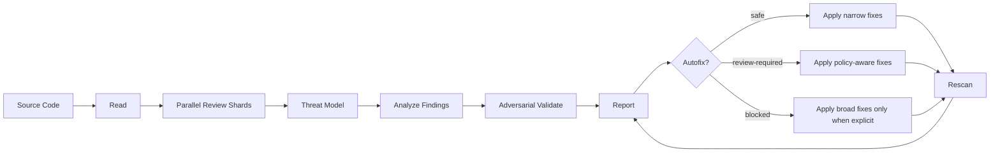

# presecurity

[English](README.md)

presecurity는 Claude와 Codex에서 사용하는 로컬 소스 기반 **코드 보안 리뷰** 플러그인입니다. 전문가와 비전문가가 코드베이스를 읽고, 실제 취약점 가능성을 검토하고, 검토 가능한 근거를 남기고, 통제된 방식으로 근본 수정까지 진행할 수 있게 돕습니다.

Codex Security artifacts의 컨셉을 경량 로컬 워크플로로 계승하지만, 별도 클라우드 서비스는 사용하지 않습니다. 호스트 코딩 에이전트가 로컬 소스 트리를 읽고, 로컬 artifact만 생성합니다.

## 설치

Repository:

```text
https://github.com/ilous12/presecurity
```

Claude Code:

```text
/plugin marketplace add https://github.com/ilous12/presecurity
/plugin install presecurity@presecurity-marketplace
```

Claude Desktop:

1. Claude Desktop을 엽니다.
2. 왼쪽 사이드바에서 Customize 메뉴를 엽니다.
3. Plugins 탭을 엽니다.
4. Personal plugins에서 `+`를 누르고 Add marketplace를 선택합니다.
5. Add from a repository를 선택합니다.
6. `https://github.com/ilous12/presecurity`를 입력합니다.
7. `presecurity`를 설치합니다.
8. 새 chat 또는 Cowork task를 시작합니다.
9. `/presecurity scan`을 실행합니다.

Codex CLI:

```text
codex plugin marketplace add ilous12/presecurity --ref main --sparse .agents/plugins --sparse plugins/codex/presecurity
codex plugin add presecurity@presecurity
```

Codex Desktop:

1. Codex settings를 엽니다.
2. Plugins를 엽니다.
3. marketplace source로 `ilous12/presecurity`를 추가합니다.
4. `presecurity`를 설치합니다.
5. 새 thread를 시작합니다.
6. `@presecurity scan`을 실행합니다.

## 무엇인가

presecurity는 단순 규칙 기반 SAST가 아닙니다. 에이전트가 수행하는 **secure code review** 워크플로입니다.

- **코드 보안 리뷰**: 소스 코드 전체 맥락을 보고 분석합니다.
- **에이전트 보조 취약점 리서치**: 파일 간 data flow, trust boundary, business logic을 추론합니다.
- **적대적 검증**: 발견 후보를 바로 보고하지 않고, 왜 오탐일 수 있는지 먼저 반박합니다.
- **근거 중심 리포트**: 재실행 없이도 검토 가능한 구조화 artifact를 남깁니다.
- **통제된 수정**: safe, review-required, blocked tier에 따라 명시적으로 수정합니다.

클라우드 스캐너나 블랙박스 테스트 러너가 아니라, 저장소 옆에서 동작하는 코드 인지형 보안 리뷰어에 가깝습니다.

## 전체 흐름



기본 scan 흐름:

```text
read -> analyze -> report
```

autofix는 별도 명령으로만 실행됩니다:

```text
read latest artifacts -> apply selected tier -> impact check -> rescan -> update report
```

## 누구에게 유용한가

| 사용자 | 제공 가치 |
| --- | --- |
| 보안 엔지니어 | exploitability reasoning, threat score, proof gap, remediation tier |
| 개발자 | 정확한 파일 위치, root cause, safe fix, 검토 필요 결정 |
| 테크 리드 | 우선순위화된 위험 요약과 수정 후 residual risk |
| 비전문 리뷰어 | 중요한 이슈만 담긴 읽기 쉬운 Markdown report |

## 명령

Claude:

```text
/presecurity
/presecurity scan
/presecurity autofix
/presecurity autofix safe
/presecurity autofix review-required
/presecurity autofix blocked
/presecurity doctor
/presecurity cleanup
```

Codex:

```text
@presecurity
@presecurity scan
@presecurity autofix
@presecurity autofix safe
@presecurity autofix review-required
@presecurity autofix blocked
@presecurity doctor
@presecurity cleanup
```

명령만 입력하면 메뉴만 표시하고 scan은 시작하지 않습니다.

| 작업 | Claude | Codex |
| --- | --- | --- |
| 명령 보기 | `/presecurity` | `@presecurity` |
| 현재 workspace scan | `/presecurity scan` | `@presecurity scan` |
| safe 수정 적용 | `/presecurity autofix` | `@presecurity autofix` |
| review-required 포함 | `/presecurity autofix review-required` | `@presecurity autofix review-required` |
| blocked 포함 | `/presecurity autofix blocked` | `@presecurity autofix blocked` |

Codex에서는 자연어 호출용 `$presecurity` skill도 제공합니다.

## 제품 원칙

- **Local-first**: presecurity cloud service가 필요 없습니다.
- **Source-based**: 코드, config, manifest, dependency file을 기반으로 분석합니다.
- **Git optional**: Git이 없어도 scan id, timestamp, root path, file hash 기반 snapshot으로 동작합니다.
- **Material findings only**: 실제 공격 경로와 개선 필요성이 있는 항목에 집중합니다.
- **False-positive control**: counterevidence, 정상 사용 흐름, 보완 통제, 우회 가능성을 검토한 뒤 보고합니다.
- **Progress-only scan output**: scan 중 화면에는 진행 상태만 표시합니다.
- **Human-in-the-loop fixes**: 정책 결정, 광범위 수정, 모호한 변경은 명시적 autofix tier 없이는 적용하지 않습니다.

사용자에게 보이는 출력은 호스트/사용자 언어 설정을 따릅니다. 영어 설정이면 영어, 한국어 설정이면 한국어로 command help, progress, summary를 표시합니다. artifact schema, JSON key, file name, command name, finding ID, code identifier는 안정적으로 유지합니다.

## 지원 코드베이스

| 영역 | 지원 대상 |
| --- | --- |
| Web | JavaScript, TypeScript, React, Next.js, Vue, Svelte |
| Backend | Node.js, Python, Java, Kotlin, Go, Ruby, PHP |
| Mobile | Java, Kotlin, Swift, Objective-C, Dart, plist |
| Native | C, C++ |
| Config | JSON, YAML, XML, plist, Dockerfile, Terraform, Gradle, Maven, GitHub Actions, CI |
| Package metadata | npm, pnpm, yarn, pip, Poetry, Gradle, Maven, pub, CocoaPods, SwiftPM |

## 탐지 범위

presecurity는 함수명 패턴이 아니라 코드 의도와 exploit path를 봅니다.

| ID | 분류 | 리뷰 초점 |
| --- | --- | --- |
| T01 | Injection | SQL, command, NoSQL, LDAP, template, eval, expression injection |
| T02 | Broken Authentication | login, session, token, password, MFA, refresh rotation |
| T03 | Broken Authorization | role, owner, tenant, resource, admin-only check |
| T04 | SSRF / Unsafe Network | user-controlled URL, redirect, internal IP, metadata endpoint |
| T05 | Secret Exposure | API key, token, certificate, client secret, checked-in credential |
| T06 | Insecure Storage | token, PII, secret, private file의 평문 저장 |
| T07 | Crypto Misuse | weak algorithm, hardcoded key, static IV, custom crypto |
| T08 | Deserialization | untrusted pickle, YAML, Java serialization, PHP/Ruby marshal |
| T09 | Path / File Access | traversal, unsafe upload/extract/delete, arbitrary file IO |
| T10 | XSS / HTML Injection | DOM sink, template output, unsafe markdown/HTML rendering |
| T11 | WebView / Client Bridge | JavaScript bridge, platform channel, untrusted content |
| T12 | Deep Link / Intent | unsafe intent extra, scheme, universal link, exported action |
| T13 | Insecure Config | debug, cleartext, CORS wildcard, ATS exception, permissive policy |
| T14 | Supply Chain | dependency confusion, lockfile risk, script hook, unsafe package |
| T15 | CI/CD / Build Script | secret logging, untrusted PR execution, unsigned release path |
| T16 | Business Logic | payment, quota, coupon, state transition, workflow bypass |
| T17 | Multi-Tenant Isolation | missing tenant filter, cross-org access, shared object leakage |
| T18 | Logging / Error Leak | token, PII, stack trace, internal URL, sensitive debug output |
| T19 | Race / TOCTOU | check/use split, replay, double submit, stale authorization |
| T20 | Resource Abuse | rate limit gap, zip bomb, unbounded upload, memory/CPU pressure |
| T21 | Native / Memory Safety | buffer overflow, UAF, format string, unsafe pointer, integer overflow |
| T22 | AI Agent / Tool Risk | prompt/tool injection, overbroad file/network/shell authority |

## Threat Scoring

모든 material finding은 측정된 threat score를 포함합니다.

```text
threatScore = likelihood x impact x reachability x exploitability x confidence
```

| Severity | Threat score | 의미 |
| --- | --- | --- |
| `critical` | `>= 0.80` | 시스템 장악, tenant/data takeover, RCE, critical secret exposure |
| `high` | `>= 0.60` | 현실적 exploit path와 높은 보안/비즈니스 영향 |
| `medium` | `>= 0.35` | 조건부 exploit path와 제한적 영향 |
| `low` | `>= 0.15` | hardening issue 또는 약한 exploit path |
| `info` | `< 0.15` | 확정 취약점이 아닌 context signal |

`findings.json`에는 기본적으로 `critical`, `high`, 의미 있는 `medium`만 포함합니다. low/info, 추측성 항목, 근거 부족 항목은 실제 위험을 바꾸지 않는 한 `coverage.json.deferredSignals` 또는 report limitation으로 보냅니다.

## 오탐 최소화

presecurity는 많은 항목을 나열하기보다 적지만 강한 finding을 보고합니다. finding은 다음을 설명할 수 있어야 합니다.

- 공격자가 제어하는 source
- 민감한 sink 또는 privileged operation
- cross-file 또는 cross-component data flow
- trust/auth/tenant/business boundary
- 현실적 exploit precondition
- 확인한 counterevidence
- 남은 proof gap

`findings.json`에 들어가기 전 모든 후보는 adversarial validation을 거칩니다.

```text
candidate finding -> 왜 오탐일 수 있는지 반박 -> 정상 동작 확인
-> 우회/보완 통제 확인 -> 보고 또는 defer
```

약하거나 추측성인 후보, 영향이 낮은 후보, 근거가 부족한 후보는 main findings가 아니라 `coverage.json.deferredSignals`로 이동합니다.

## 산출물

모든 scan은 로컬 artifact bundle을 생성합니다.

```text
.presecurity/
  scans/
    scan-YYYYMMDD-HHMMSS/
      scan-manifest.json
      scan-summary.json
      repository-map.json
      threat-model.json
      findings.json
      coverage.json
      validation/
        F-001.json
      patches/
        F-001.patch.md
      report.md
```

autofix는 추가로 다음을 생성합니다.

```text
      fix-plan.json
      autofix-result.json
```

| Artifact | 목적 |
| --- | --- |
| `scan-manifest.json` | target, scan id, snapshot identity, language summary, path, limitation |
| `scan-summary.json` | executive result, severity total, measured risk distribution, top risk |
| `repository-map.json` | file, framework, entry point, dependency, config surface, sink |
| `threat-model.json` | asset, trust boundary, auth assumption, data path, scoped-out area |
| `findings.json` | score, evidence, counterevidence, proof gap이 포함된 high-signal finding |
| `validation/<id>.json` | adversarial validation, false-positive check, exploitability check, proof gap |
| `patches/<id>.patch.md` | root-cause patch proposal, diff summary, test plan, residual risk |
| `coverage.json` | reviewed file, skipped file, deferred signal, limitation |
| `report.md` | 사람이 읽는 scan report |
| `fix-plan.json` | safe/review-required/blocked fix classification |
| `autofix-result.json` | applied change, skipped item, rescan result |

## Autofix 정책

presecurity는 기본적으로 safe fix만 적용합니다. 더 위험한 tier는 명시적 명령이 필요합니다.

| Tier | 의미 | 기본 동작 |
| --- | --- | --- |
| `safe` | 동작 위험이 낮고 결정적인 좁은 수정 | 기본 autofix로 적용 가능 |
| `review-required` | 보안 정책 또는 비즈니스 의도 결정 필요 | review-required mode 필요 |
| `blocked` | 의도가 불명확하거나 광범위/파괴적 수정 | blocked mode 필요 |

| Claude command | Codex command | 처리 tier |
| --- | --- | --- |
| `/presecurity autofix` | `@presecurity autofix` | `safe` |
| `/presecurity autofix safe` | `@presecurity autofix safe` | `safe` |
| `/presecurity autofix review-required` | `@presecurity autofix review-required` | `safe` -> `review-required` |
| `/presecurity autofix blocked` | `@presecurity autofix blocked` | `safe` -> `review-required` -> `blocked` |

scan 이후 presecurity는 필요한 가장 높은 autofix command를 추천합니다.

| 최신 scan 상태 | Claude 추천 | Codex 추천 |
| --- | --- | --- |
| `blocked` 존재 | `/presecurity autofix blocked` | `@presecurity autofix blocked` |
| `blocked` 없음, `review-required` 존재 | `/presecurity autofix review-required` | `@presecurity autofix review-required` |
| `safe`만 존재 | `/presecurity autofix safe` | `@presecurity autofix safe` |
| fixable 없음 | 추천 없음 | 추천 없음 |

추천은 안내일 뿐입니다. scan은 autofix를 자동 실행하지 않습니다.

autofix는 하나씩 순차 적용하고, 각 수정 후 impact check와 rescan을 수행합니다. diff가 광범위하거나 파괴적이거나 모호해지면 중단합니다.

수정은 root cause를 해결해야 합니다. 예를 들어 SSRF는 승인된 destination allowlist 또는 중앙 outbound policy가 필요합니다. private IP, metadata host blocklist는 defense-in-depth일 뿐 allowlist를 대체할 수 없습니다. 필요한 비즈니스/보안 정책이 없으면 코드를 수정하지 않고 unresolved로 남깁니다.

## 명령 결과 표시

scan 중에는 progress만 표시합니다.

```text
presecurity: 파일 읽는 중...
presecurity: 신뢰 경계 분석 중...
presecurity: 발견 결과 검증 중...
presecurity: 리포트 작성 중...
```

scan 완료 후에는 compact result만 표시합니다.

```text
Artifact: .presecurity/scans/scan-YYYYMMDD-HHMMSS/
Risk: critical 0 / high 1 / medium 2
Validation: confirmed 2 / deferred 5 / blocked 1
Autofix: safe 1 / review-required 2 / blocked 1
Recommended: /presecurity autofix blocked

Top findings:
| ID | Severity | Validation | Title | Autofix |
| --- | --- | --- | --- | --- |
| F-001 | high | confirmed | url 파라미터를 통한 SSRF | review-required |
```

Claude는 `/presecurity ...`, Codex는 `@presecurity ...` 형식으로 추천 명령을 표시합니다. raw evidence, 긴 attack path, patch detail, file write log는 chat에 출력하지 않고 artifact에 기록합니다.

## 예시

```text
Claude:
/presecurity scan examples
/presecurity scan examples/mobile/android-kotlin
/presecurity autofix

Codex:
@presecurity scan examples
@presecurity scan examples/mobile/android-kotlin
@presecurity autofix
```

`examples/` 폴더는 플러그인 개발 테스트용 취약 코드 fixture입니다. production sample이 아닙니다.

## 문서

- [Implementation readiness](docs/implementation-readiness.md)
- [Development TODO](docs/development-plan.md)
- [Supported platforms](docs/supported-platforms.md)
- [Example vulnerable fixtures](examples/README.md)
